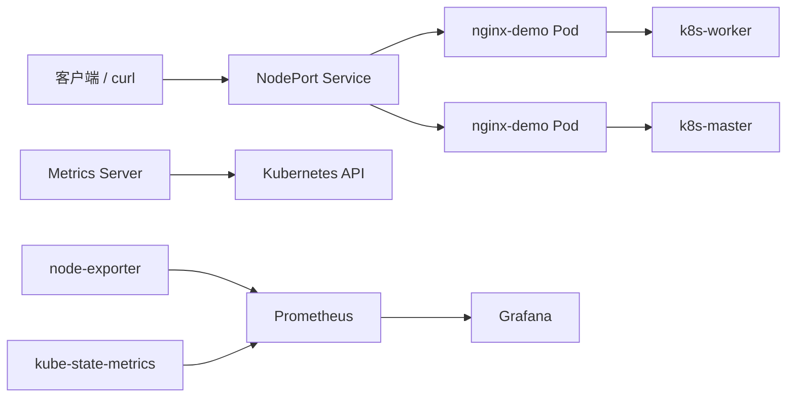

# Kubernetes 云原生监控与故障排查实验平台

这是一个面向云原生实习求职的本地 Kubernetes 实验项目。项目以双节点 kubeadm 集群为基础，完成容器化应用部署、Service 暴露、滚动更新、故障自愈，以及 Prometheus + Grafana 监控链路建设。

## 项目亮点

- 使用 kubeadm 搭建双节点 Kubernetes 集群（Control Plane + Worker）。
- 使用 Flannel 提供 Pod 网络，验证 Pod 跨节点通信。
- 使用 Deployment 管理 Nginx，验证副本扩容和 Pod 故障自愈。
- 使用 NodePort 暴露服务，并通过 Endpoint、kube-proxy、nftables 定位访问故障。
- 使用 Metrics Server、node-exporter、kube-state-metrics、Prometheus 和 Grafana 构建监控链路。
- 记录镜像离线导入、CoreDNS、PVC、证书、代理和 NodePort 等真实故障的排查过程。

## 架构



## 目录

```text
docs/
├── 架构说明.md                              架构与请求/监控链路
├── 项目摘要.md                              简历与面试项目说明
├── 完整部署过程.md                          从双节点集群到监控的复现步骤
├── 通用排障.md                              通用排障手册
├── Kubernetes 云原生实验集群排障记录.md    按时间记录的完整实验排障过程
└── incidents/                              按具体问题归档的故障复盘
k8s/app/                                    Nginx Deployment 与 NodePort Service
monitoring/                                 PromQL 查询示例
```

## 快速验证

```bash
kubectl apply -f k8s/app/nginx-demo-deployment.yaml
kubectl apply -f k8s/app/nginx-demo-service.yaml
kubectl get pods -l app=nginx-demo -o wide
kubectl get endpoints nginx-demo-svc
kubectl get svc nginx-demo-svc
```

NodePort 端口以 `kubectl get svc` 的实际输出为准。实验中曾使用 `31258`，不同集群可能分配不同端口。

完整部署步骤见 [`docs/完整部署过程.md`](docs/%E5%AE%8C%E6%95%B4%E9%83%A8%E7%BD%B2%E8%BF%87%E7%A8%8B.md)。

## 监控验证

```bash
kubectl top nodes
kubectl top pods -A
```

在 Prometheus 的 Targets 页面确认采集目标为 `UP`，在 Grafana 中配置 Prometheus 数据源后导入或创建 Dashboard。常用查询见 [`monitoring/promql-examples.md`](monitoring/promql-examples.md)。

## 故障排查方法

遇到问题时遵循：

```text
状态 → 节点 → Events → 日志 → Service/Endpoint → 节点网络 → kubelet/containerd/kube-proxy → 修复 → 验证
```

完整案例见 [`docs/通用排障.md`](docs/%E9%80%9A%E7%94%A8%E6%8E%92%E9%9A%9C.md)、[`docs/Kubernetes 云原生实验集群排障记录.md`](docs/Kubernetes%20云原生实验集群排障记录.md) 和 [`docs/incidents/`](docs/incidents/)。

## 安全说明

仓库不包含 kubeconfig、SSH 私钥、密码、Token、镜像 tar 包、Prometheus 数据目录或真实敏感日志。节点 IP、用户名和镜像版本应按公开仓库需要进行脱敏或替换。

## 项目状态

当前实验已完成 Kubernetes 应用部署、NodePort、扩容、自愈和 Prometheus/Grafana 基础监控。后续计划是补充 CI/CD 自动发布、告警规则和持久化存储。
